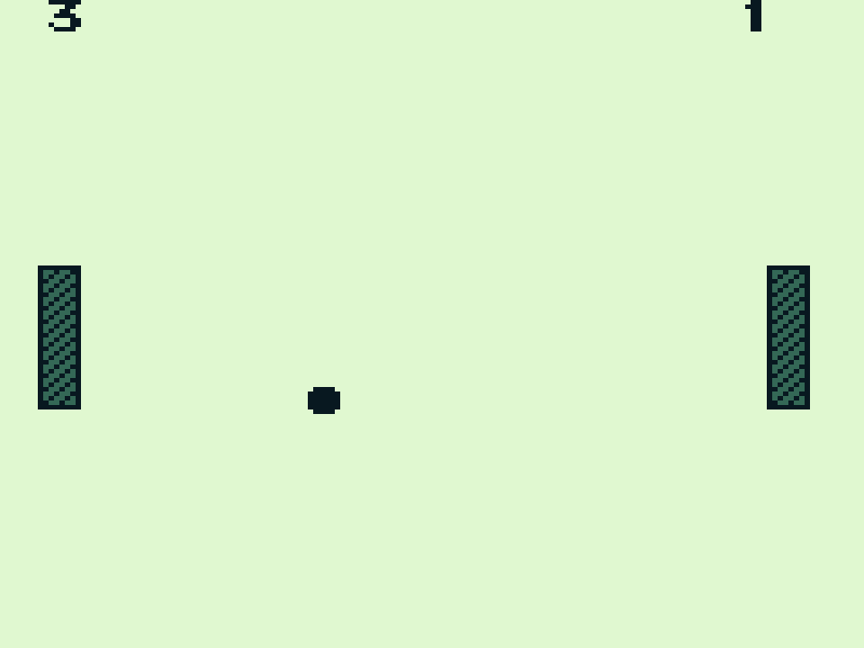

# gb-pong-clone
Pong game re-created for Nintendo Gameboy using GBDK  
Run 'make.bat' to compile (a copy of GBDK must exist in C:/)  
Compilation produces a 'gb-pong.gb', which can be run on a Nintendo Game Boy emulator  
OR just download 'gb-pong.gb' and try it on a Gameboy emulator 

